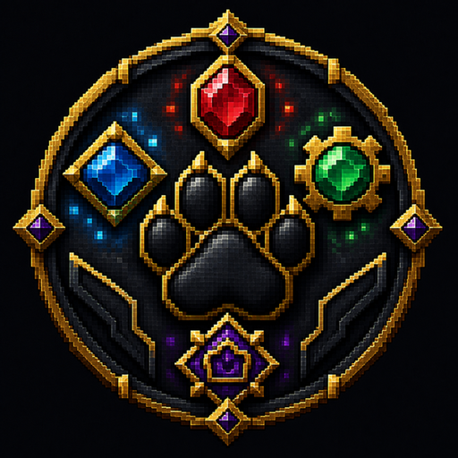

# CatItems

CatItems is a standalone YAML custom-item registry and resource-pack engine for
Paper 1.21 through 1.21.11. It assigns stable item identities, builds the
version-correct pack, and exposes a public Bukkit service API for other plugins.

## Features

- unlimited items and namespaces from `items/*.yml`
- persistent PDC identity through `catitems:item_id`
- stable automatic CustomModelData allocation
- modern `minecraft:item_model` definitions on Minecraft 1.21.4+
- legacy model overrides on Minecraft 1.21 through 1.21.3
- pack metadata for Paper 1.21 through 1.21.11
- deterministic ZIP build with SHA-1 calculation
- external pack URL, optional built-in HTTP server, or disabled delivery
- automatic join delivery and status diagnostics
- MiniMessage/RGB item names and lore
- public Bukkit service API and a queryable feature catalog
- four ready-to-use starter items with compact 3D models

## Requirements

- Java 21
- Paper 1.21 through 1.21.11
- No plugin dependencies

ItemsAdder, Oraxen, Nexo, and CatDrugs are not required.

## Installation

1. Place `CatItems-0.2.1-ALPHA.jar` in the server's `plugins/` directory.
2. Start Paper once.
3. Configure a public resource-pack URL or intentionally enable self-hosting.
4. Add item YAML files under `plugins/CatItems/items/` and pack assets under
   `plugins/CatItems/pack/assets/`.
5. Run `/catitems reload`, then `/catitems status`.

## Documentation

- [Getting started](START_HERE.md)
- [Item format](docs/ITEM_FORMAT.md)
- [Configuration](docs/CONFIGURATION.md)
- [Commands and permissions](docs/COMMANDS.md)
- [Public API](docs/API.md)
- [Feature parity map](docs/ITEMSADDER_PARITY.md)
- [Download description](docs/DOWNLOAD_DESCRIPTION.md)
- [Changelog](CHANGELOG.md)

## Alpha Notice

This release focuses on custom items and resource packs. Custom blocks,
furniture, entities, HUDs, sounds, armor geometry, and a web editor are not yet
implemented. Test the public pack URL and proxy/firewall setup before production.

---
Made By CatgirlYannick
